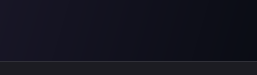

<div align="center">

# Flowe

**Hold Ctrl+Win, talk, let go. Your words are pasted where your cursor is.**

Local push-to-talk dictation for Windows, powered by NVIDIA Parakeet on your own GPU.<br>
No cloud, no account, no usage limits.



</div>

## Why

Wispr Flow has usage limits and FluidVoice is Mac-only. Flowe does the one thing they do,
locally:

- **Fast and private.** Parakeet TDT 0.6B v2 runs through ONNX Runtime + DirectML on any Windows
  GPU (no CUDA needed, CPU fallback). A 10 s clip transcribes in ~0.3 s on an RTX 4070.
- **Weightless when idle.** One ~22 MB Rust exe. The mic is closed and no timers run, so CPU sits at
  0.00% until you press the hotkey. Pausing unhooks even the keyboard.
- **Out of the way.** A tiny dash above the taskbar says it's listening. It becomes a pill while you
  talk, with soft keyboard-"thock" sounds on start, stop and lock.

## Pick your visualization

Each one reacts to your voice, scales itself to how loud you talk, and settles the moment you stop.

| | |
|:-:|:-:|
| <br>**Waves**: level bars | <br>**Liquid**: spring-physics water with splashes |
| <br>**Plasma**: new random colours every recording | <br>**Lava lamp**: merging glowing blobs |

Red dot = recording, amber padlock = locked hands-free. Pick a style in the dashboard to preview it.

## Controls

| Keys | What happens |
|---|---|
| Hold **Ctrl+Win** | records while held, pastes when you let go |
| ...then tap **Space** | locks: keeps recording hands-free; press Ctrl+Win again to stop |
| **Esc** while locked | cancels |
| Ctrl+Win + any other key | cancels and passes through, so Ctrl+Win+Left etc. still work |

Taps under 0.3 s are ignored, and a forgotten locked recording stops itself after 5 minutes.
The transcript also stays on the clipboard.

**Dashboard** (opens on launch, or click the tray badge): pause/resume, recording history
(double-click a row to copy it again), word counts and usage stats, indicator style, sounds on/off.

## Install

Building needs Rust and the MSVC build tools:
`winget install Rustlang.Rustup Microsoft.VisualStudio.2022.BuildTools` (with the "Desktop development with C++" workload).

```powershell
cargo build --release
.\download-model.ps1   # 2.4 GB from Hugging Face -> %LOCALAPPDATA%\Flowe\model
.\install.ps1          # copies the exe to %LOCALAPPDATA%\Flowe, adds a Start Menu entry, launches
```

Then press the Windows key and type "Flowe". Quit Wispr Flow first (or change its hotkey), or both
will react to Ctrl+Win.

- `.\install.ps1 -Startup` also launches Flowe hidden at sign-in. `.\install.ps1 -Uninstall` removes the shortcuts.

<details>
<summary><b>Files, notes and dev commands</b></summary>

**`%LOCALAPPDATA%\Flowe\`**

- `model\`: the ONNX model.
- `history.tsv`: your recordings (time, audio length, transcription time, words, text). "Clear history" deletes it.
- `flowe.log`: timings and errors only, never transcript text.
- `settings.txt`: indicator style and sounds on/off.

**Notes**

- About 400 MB of RAM while idle: that is the model staying loaded so transcription is instant.
- Apps running as Administrator only receive the paste if Flowe runs elevated too.

**Dev commands**

- `cargo test`: runs the unit tests.
- `cargo run --release --bin mkicon`: regenerates the app icon.
- `cargo run --release --features demo --bin demo`: re-renders the GIFs above with the real overlay code.

**Credits**

- `assets/nemo128.onnx` (mel preprocessor) comes from [onnx-asr](https://github.com/istupakov/onnx-asr), MIT.
- The model export is [istupakov/parakeet-tdt-0.6b-v2-onnx](https://huggingface.co/istupakov/parakeet-tdt-0.6b-v2-onnx), CC-BY-4.0.

</details>
